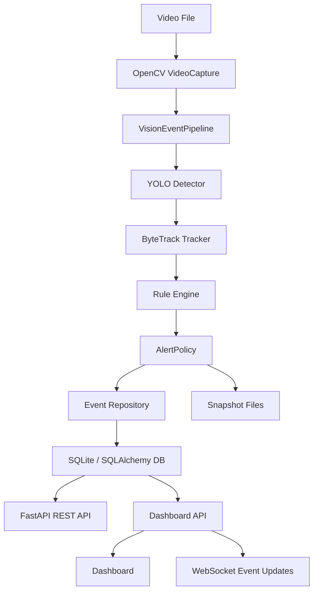

# Edge AI Vision Event Monitoring Platform

## 프로젝트 소개

Edge AI Vision Event Monitoring Platform은 로컬 영상 파일을 입력으로 받아 객체를 검출하고, 추적 결과에 규칙을 적용해 이벤트를 생성하는 FastAPI 기반 프로젝트입니다.

현재 구현은 영상 파일 기반 파이프라인, 이벤트 저장, REST API, 대시보드 확인 기능을 중심으로 구성되어 있습니다. 실제 카메라 실시간 스트림 연동과 운영 배포 구성이 완료된 상태는 아닙니다.

## 시스템 아키텍처

현재 코드 기준의 주요 처리 흐름은 다음과 같습니다.



`scripts/run_video.py`가 영상 파일을 프레임 단위로 읽고 `VisionEventPipeline`에 전달합니다. 파이프라인은 객체 검출, 객체 추적, 규칙 평가, 알림 중복 제어를 거쳐 이벤트를 만들고, 저장 옵션이 켜져 있으면 이벤트와 snapshot을 저장합니다.

## 주요 기능

- YOLO 기반 객체 검출
- ByteTrack 스타일 객체 추적
- Rule Engine 기반 이벤트 생성
- danger-zone, loitering, person-count 규칙
- Alert cooldown 기반 반복 이벤트 제어
- 이벤트 저장
- 이벤트 발생 프레임 snapshot 저장
- REST API를 통한 이벤트 조회
- 대시보드 화면을 통한 저장 이벤트 확인
- WebSocket 기반 이벤트 갱신
- API key 기반 보호 설정
- pytest 기반 단위 테스트

## 기술 스택

| 영역 | 기술 |
| --- | --- |
| API | FastAPI, Pydantic, Uvicorn |
| Vision | OpenCV, Ultralytics YOLO |
| Tracking | ByteTrack 스타일 tracker, `lapx` |
| Rule | Python rule evaluator, YAML 설정 |
| Persistence | SQLAlchemy, SQLite, PostgreSQL driver |
| Dashboard | FastAPI HTML response, JavaScript, WebSocket |
| Test | pytest, httpx, FastAPI TestClient |
| Runtime | Python 3.12, Docker, Docker Compose |

## 프로젝트 구조

```text
main.py                  기본 FastAPI 앱 entrypoint
api/main.py              대시보드용 FastAPI 앱 entrypoint
api/dashboard_assets.py  대시보드 HTML/CSS/JS 렌더링
app/
  api/                   기본 REST API route
  core/                  설정 로딩, 보안 설정
  database/              SQLAlchemy model, session, health check
  detector/              YOLO detector adapter
  pipeline/              frame-to-event orchestration
  repositories/          SQLAlchemy 기반 event repository
  rules/                 danger-zone, loitering, person-count rule
  schemas/               API response schema
  services/              camera health registry, event service
  tracker/               tracking adapter
storage/                 SQLite 전용 saved-event repository
config/config.yaml       app, database, camera, rule, alert 설정
scripts/run_video.py     로컬 영상 파일 파이프라인 실행
scripts/seed_dashboard_data.py
                         대시보드 확인용 sample event 생성
tests/                   unit/integration test suite
docker/Dockerfile        컨테이너 이미지 정의
docker-compose.yml       app + PostgreSQL 로컬 실행 구성
```

## 실행 방법

### 의존성 설치

```bash
pip install -r requirements.txt
```

### 기본 API 실행

기본 API entrypoint는 `main:app`입니다.

```bash
uvicorn main:app --reload
```

상태 확인:

```bash
curl http://localhost:8000/health
curl http://localhost:8000/health/db
```

### 영상 파일 파이프라인 실행

```bash
python scripts/run_video.py /path/to/video.mp4 --camera-id gate_01
```

이벤트와 snapshot을 저장하려면 다음 옵션을 사용합니다.

```bash
python scripts/run_video.py /path/to/video.mp4 \
  --camera-id gate_01 \
  --save-events \
  --db-path data/events.db \
  --snapshot-dir data/snapshots
```

설정 파일에 정의된 camera 목록을 사용하려면 다음 명령을 실행합니다.

```bash
python scripts/run_video.py --config config/config.yaml
```

### 대시보드 실행

대시보드는 `api.main:app`에서 제공합니다. 기본적으로 `data/events.db`와 `data/snapshots`를 사용합니다.

```bash
python scripts/seed_dashboard_data.py --reset --count 40
EVENT_DB_PATH=data/events.db SNAPSHOT_DIR=data/snapshots uvicorn api.main:app --reload
```

브라우저에서 다음 주소를 엽니다.

```text
http://localhost:8000/dashboard
```

대시보드의 WebSocket은 저장된 이벤트를 주기적으로 확인해 새 이벤트를 화면에 반영합니다.

### Docker Compose 실행

Docker Compose는 `main:app`과 PostgreSQL을 함께 실행합니다.

```bash
docker compose up --build
```

API 주소:

```text
http://localhost:8000
```

컨테이너 안에서 영상 파일 파이프라인을 실행할 수 있습니다.

```bash
docker compose exec app python scripts/run_video.py \
  /app/data/videos/sample.mp4 \
  --camera-id gate_01 \
  --save-events
```

## 주요 API

`main:app`의 기본 API:

| Method | Path | 설명 |
| --- | --- | --- |
| `GET` | `/health` | 서비스 상태 확인 |
| `GET` | `/health/db` | DB 연결 상태 확인 |
| `GET` | `/events` | 최근 이벤트 목록 조회 |
| `GET` | `/events/latest` | 최신 이벤트 조회 |
| `GET` | `/events/{event_id}` | 단일 이벤트 조회 |
| `GET` | `/events/stats` | 이벤트 통계 조회 |
| `GET` | `/cameras/health` | 런타임 메모리 기준 카메라 health 조회 |

`api.main:app`에서 제공하는 대시보드 관련 API:

| Method | Path | 설명 |
| --- | --- | --- |
| `GET` | `/`, `/dashboard` | 대시보드 HTML |
| `GET` | `/stats` | 대시보드용 통계 alias |
| `GET` | `/snapshots/{snapshot_path}` | snapshot 파일 조회 |
| `WS` | `/ws/events` | 저장 이벤트 갱신용 WebSocket |

`API_KEY`가 설정된 경우 보호 대상 API에는 `X-API-Key` header를 전달해야 합니다.

```bash
curl -H "X-API-Key: change-me" \
  "http://localhost:8000/events/latest?limit=5&camera_id=gate_01"
```

## 테스트

전체 테스트 실행:

```bash
python -m pytest
```

CI처럼 native vision dependency 부담을 줄인 환경에서는 다음 의존성을 사용할 수 있습니다.

```bash
pip install -r requirements-ci.txt
python -m pytest
```

현재 테스트는 파이프라인, 규칙, 저장소, API, 보안 설정, 카메라 health, 설정 로딩, snapshot path 검증을 포함합니다.

## 향후 개선 예정

- FastAPI App 통합
- SQLAlchemy Repository 통합
- RTSP Camera Stream 지원
- PostgreSQL 운영 환경 개선
- Alembic Migration 적용
- 인증 및 권한 구조 개선
