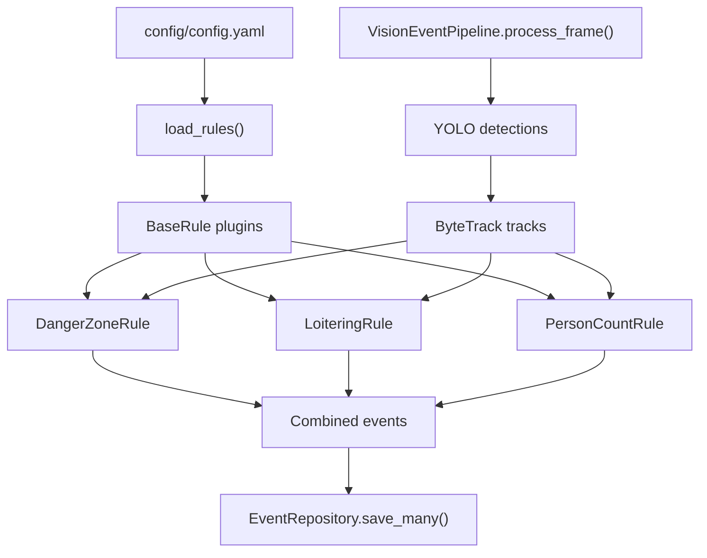

# Vision Event Platform

A real-time vision event platform built with YOLO, ByteTrack, FastAPI, PostgreSQL, and Docker.

The goal of this project is to transform object detection results into an event-driven system that can be monitored, queried, and managed through APIs.

## Architecture

```text
Video Stream
    ↓
YOLO Detector
    ↓
ByteTrack Tracker
    ↓
Rule Engine
    ├─ DangerZoneRule
    ├─ LoiteringRule
    └─ PersonCountRule
    ↓
Event Service
    ↓
PostgreSQL
    ↓
FastAPI API
```

The event evaluation layer is plugin-based. `VisionEventPipeline` detects and
tracks each frame once, then passes the same track list to every enabled rule
loaded from `config/config.yaml`. Each rule implements `BaseRule.evaluate()` and
returns the same event model, so event persistence and API responses remain
unchanged.



## Features

### Current

- FastAPI application
- Health check endpoint
- Project structure initialization
- Docker environment
- PostgreSQL integration skeleton
- Event processing architecture
- SQLite event persistence
- Read-only saved event API
- Event frame snapshot storage and dashboard thumbnails
- Plugin-based rule engine
- Danger zone, loitering, and person-count rules

### Planned

- YOLO object detection
- ByteTrack object tracking
- Event persistence
- Event query APIs
- Dashboard integration
- CI/CD pipeline

## Tech Stack

### Vision

- OpenCV
- YOLO
- ByteTrack

### Backend

- FastAPI
- PostgreSQL

### DevOps

- Docker
- GitHub Actions

## Run Locally

Install the full runtime dependency set before running the application:

```bash
pip install -r requirements.txt
```

Start the original application skeleton:

```bash
uvicorn main:app --reload
```

Health check:

```bash
curl http://localhost:8000/health
```

Run the local video pipeline against a video file:

```bash
python scripts/run_video.py /path/to/video.mp4
```

The runner reads frames with OpenCV, passes each frame through
`VisionEventPipeline.process_frame()`, prints any emitted events to the console,
and exits gracefully when it reaches the end of the file.

Save emitted events to a local SQLite database while still printing JSON lines:

```bash
python scripts/run_video.py /path/to/video.mp4 --save-events --db-path data/events.db
```

If `--db-path` is omitted, the video runner writes to `data/events.db`.
When the runner emits an event, it writes the current frame to
`data/snapshots/` as a JPEG and stores the snapshot path with the saved event.
Use `--snapshot-dir` to choose a different local snapshot directory:

```bash
python scripts/run_video.py /path/to/video.mp4 --save-events --snapshot-dir data/snapshots
```

## Rule Configuration

Rules are loaded from `config/config.yaml`. Multiple enabled rules run on the
same tracked frame, and their emitted events are combined before persistence.

```yaml
rules:
  - type: danger_zone
    enabled: true
    config:
      danger_zone: [[100, 100], [500, 100], [500, 500], [100, 500]]
      threshold_sec: 3
      notify_interval_sec: 60

  - type: loitering
    enabled: true
    config:
      roi: [[120, 120], [480, 120], [480, 480], [120, 480]]
      threshold_sec: 10
      notify_interval_sec: 60

  - type: person_count
    enabled: true
    config:
      threshold: 5
      notify_interval_sec: 30
```

Rule behavior:

- `danger_zone`: emits `danger_zone` when a person remains inside the configured
  polygon longer than `threshold_sec`.
- `loitering`: emits `loitering` when a person remains inside the configured ROI
  for `threshold_sec`.
- `person_count`: emits `person_count` when the number of tracked people exceeds
  `threshold`.

To add another rule, create a class that extends `BaseRule`, implement
`evaluate(tracks, timestamp)`, and register its `type` in the rule loader.

List saved SQLite events as JSON lines:

```bash
python scripts/list_events.py --db-path data/events.db
```

Start the read-only saved events API:

```bash
EVENT_DB_PATH=data/events.db uvicorn api.main:app --reload
```

`EVENT_DB_PATH` is optional. If it is not set, the API reads from
`data/events.db`.

Open the saved events dashboard in a browser:

```text
http://localhost:8000/
http://localhost:8000/dashboard
```

The dashboard is server-rendered by FastAPI. It shows service status, total
event count, event count by type, and the latest saved events from the same
SQLite database used by the API. Latest events include a Snapshot column with a
thumbnail when `snapshot_path` is present. Clicking a thumbnail opens the
full-size JPEG from `GET /snapshots/{filename}`. Missing snapshot files return a
404 from the snapshot endpoint and do not prevent the dashboard from rendering.

Example API requests:

```bash
curl http://localhost:8000/health
curl "http://localhost:8000/events?limit=25&offset=0"
curl "http://localhost:8000/events?event_type=danger_zone&limit=10"
curl "http://localhost:8000/events/latest?limit=5"
curl http://localhost:8000/snapshots/example.jpg
curl http://localhost:8000/stats
```

## Tests

GitHub Actions installs the lean unit-test dependency set from `requirements-ci.txt`.
The full local runtime stack, including OpenCV, Ultralytics, ByteTrack, and psycopg,
remains documented in `requirements.txt`.

```bash
pip install -r requirements-ci.txt
pytest
```

## Project Status

🚧 Under Active Development
