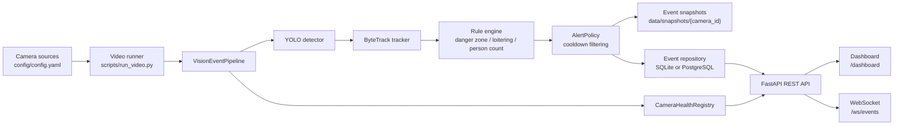

# Edge AI Vision Event Monitoring Platform

영상 기반 이벤트를 감지하거나 수신하고, 이를 저장한 뒤 실시간 Dashboard에서 확인할 수 있는 Edge AI Vision Event Monitoring Platform입니다.

이 프로젝트는 단순히 모델 추론 결과를 출력하는 데서 끝나지 않고, 카메라 입력, 객체 감지, 추적, 규칙 기반 이벤트 판정, 알림 중복 제어, 스냅샷 저장, 데이터베이스 영속화, REST API, WebSocket 기반 실시간 Dashboard까지 이어지는 백엔드 중심 구조를 보여주는 것을 목표로 합니다.

## 프로젝트 소개

Vision Event Platform은 보안, 시설 운영, 안전 모니터링처럼 카메라에서 발생하는 이벤트를 빠르게 확인하고 나중에 조회해야 하는 상황을 가정해 만든 포트폴리오 프로젝트입니다.

카메라 영상은 YOLO detector와 ByteTrack 스타일 tracker를 거쳐 객체와 track 단위로 정리됩니다. 이후 danger-zone 진입, loitering, person-count 같은 규칙이 적용되고, alert cooldown 정책을 통해 반복 이벤트를 줄입니다. 승인된 이벤트는 SQLite 또는 PostgreSQL에 저장할 수 있으며, 필요한 경우 이벤트 발생 프레임을 JPEG 스냅샷으로 남깁니다.

FastAPI는 이벤트 조회용 REST API, Dashboard 페이지, Dashboard가 사용하는 WebSocket endpoint를 제공합니다. 로컬 개발 환경에서는 SQLite를 기본 저장소로 사용하며, Docker Compose 실행에서는 PostgreSQL을 사용할 수 있습니다.

## 주요 기능

- **Edge AI 이벤트 파이프라인**: 영상 프레임을 감지, 추적, 규칙 평가, 이벤트 저장 단계로 처리합니다.
- **규칙 기반 이벤트 판정**: danger-zone, loitering, person-count 이벤트를 설정 기반으로 적용합니다.
- **멀티 카메라 처리**: `config/config.yaml`에 정의된 여러 카메라 입력을 처리하고 이벤트에 `camera_id`를 기록합니다.
- **Alert cooldown**: 같은 규칙에서 반복적으로 발생하는 이벤트가 저장소와 API client를 과도하게 채우지 않도록 제어합니다.
- **이벤트 스냅샷 저장**: 이벤트 발생 시점의 프레임을 `data/snapshots/{camera_id}` 아래에 JPEG로 저장할 수 있습니다.
- **REST API**: health check, 이벤트 목록, 최신 이벤트, 이벤트 통계, 카메라 상태를 제공합니다.
- **실시간 Dashboard**: `/dashboard`에서 최신 이벤트, 이벤트 통계, 카메라 health, 스냅샷 썸네일을 확인합니다.
- **WebSocket 이벤트 스트림**: `/ws/events`로 새 이벤트를 실시간 전송합니다.
- **보안 설정**: 환경 변수로 API key 보호, Dashboard 보호, 문서 노출 여부를 제어합니다.
- **테스트 가능한 구조**: 파이프라인, 규칙, repository, API, 보안 설정, camera health를 pytest로 검증합니다.

## 기술 스택

| 영역 | 기술 |
| --- | --- |
| API | FastAPI, Pydantic, Uvicorn |
| Vision | OpenCV, Ultralytics YOLO |
| Tracking | ByteTrack 스타일 tracker, `lapx` |
| Rule Engine | Python rule evaluator, YAML 기반 설정 |
| Persistence | SQLAlchemy, SQLite, PostgreSQL, psycopg |
| Dashboard | FastAPI HTML response, REST polling fallback, WebSocket |
| Runtime | Python 3.12, Docker, Docker Compose |
| Test | pytest, httpx, FastAPI TestClient |

## 시스템 아키텍처



처리 흐름은 다음과 같습니다.

1. 카메라 입력은 `config/config.yaml` 또는 CLI 인자로 전달됩니다.
2. `scripts/run_video.py`가 카메라별 `VisionEventPipeline` context를 생성합니다.
3. 각 프레임은 detector, tracker, rule engine을 순서대로 통과합니다.
4. 발생한 이벤트는 `camera_id`와 함께 alert cooldown 정책을 거칩니다.
5. 저장 옵션이 켜져 있으면 이벤트 metadata와 snapshot path가 데이터베이스에 저장됩니다.
6. FastAPI가 저장된 이벤트, 통계, 카메라 상태를 API와 Dashboard로 제공합니다.
7. Dashboard는 `/ws/events`를 통해 새 이벤트를 실시간으로 수신합니다.

## 프로젝트 구조

```text
app/
  api/                 FastAPI REST route
  core/                설정 로딩, 보안 설정, 환경 변수 처리
  database/            SQLAlchemy model, session, database health check
  detector/            YOLO detector adapter
  pipeline/            frame-to-event orchestration
  repositories/        database-backed event repository
  rules/               danger-zone, loitering, person-count rule
  schemas/             API response schema
  services/            camera health registry, event service
  tracker/             tracking adapter
api/
  main.py              local demo Dashboard API, WebSocket, SQLite saved-event API
  dashboard_assets.py  Dashboard HTML/CSS/JS renderer
config/config.yaml     camera, rule, alert, database 설정
scripts/run_video.py   local/container video pipeline runner
scripts/seed_dashboard_data.py
                       local Dashboard demo data 생성
storage/               SQLite 기반 saved-event repository
tests/                 unit/integration test suite
docker/Dockerfile      API container image
docker-compose.yml     API + PostgreSQL stack
```

## 실행 방법

### 1. 의존성 설치

```bash
pip install -r requirements.txt
```

### 2. 기본 FastAPI 앱 실행

프로젝트의 기본 API entrypoint는 `main:app`입니다.

```bash
uvicorn main:app --reload
```

로컬 개발 설정은 `config/config.yaml` 기준으로 SQLite를 사용합니다.

```text
sqlite:///data/events.db
```

Health check:

```bash
curl http://localhost:8000/health
curl http://localhost:8000/health/db
```

### 3. 단일 영상 파이프라인 실행

```bash
python scripts/run_video.py /path/to/video.mp4 --camera-id gate_01
```

이벤트와 스냅샷을 로컬에 저장하려면 다음 옵션을 사용합니다.

```bash
python scripts/run_video.py /path/to/video.mp4 \
  --camera-id gate_01 \
  --save-events \
  --db-path data/events.db \
  --snapshot-dir data/snapshots
```

### 4. 설정 파일 기반 멀티 카메라 실행

```bash
python scripts/run_video.py --config config/config.yaml
```

예시 설정:

```yaml
cameras:
  - id: gate_01
    source: data/videos/video1.mp4
  - id: gate_02
    source: data/videos/video2.mp4
```

### 5. Docker Compose 실행

Docker Compose는 PostgreSQL을 함께 실행합니다. `docker-compose.yml`에서 `DATABASE_URL`을 app container에 주입하므로 `config/config.yaml`의 SQLite 설정보다 우선합니다.

```bash
docker compose up --build
```

API 주소:

```text
http://localhost:8000
```

Compose 구성:

- `app`: `main:app`을 실행하는 FastAPI service
- `postgres`: health check가 포함된 PostgreSQL 16 service
- `postgres_data`: database volume
- `./data:/app/data`: 로컬 영상, SQLite 파일, snapshot 저장용 bind mount

Container 내부에서 영상 파이프라인 실행:

```bash
docker compose exec app python scripts/run_video.py \
  /app/data/videos/sample.mp4 \
  --camera-id gate_01 \
  --save-events
```

저장된 이벤트 확인:

```bash
curl "http://localhost:8000/events/latest?limit=5"
```

### 6. API image만 실행

```bash
docker build -f docker/Dockerfile -t vision-event-platform .

docker run --rm -p 8000:8000 \
  -e DATABASE_URL=sqlite:///data/events.db \
  -v "$PWD/data:/app/data" \
  vision-event-platform
```

## 주요 API

`main:app`은 운영 API에 가까운 entrypoint이고, `api.main:app`은 로컬 포트폴리오 Dashboard와 SQLite saved-event API를 포함한 demo entrypoint입니다. 두 앱 모두 FastAPI 기반이며, Dashboard 관련 route는 `api.main:app`에서 제공합니다.

| Method | Path | 설명 | 인증 |
| --- | --- | --- | --- |
| `GET` | `/health` | 서비스 상태 확인 | public |
| `GET` | `/health/db` | DB 연결 상태 확인 | `API_KEY` 설정 시 `X-API-Key` 필요 |
| `GET` | `/events` | 최근 이벤트 목록 조회 | `API_KEY` 설정 시 `X-API-Key` 필요 |
| `GET` | `/events/latest` | 최신 이벤트 조회 | `API_KEY` 설정 시 `X-API-Key` 필요 |
| `GET` | `/events/{event_id}` | 단일 이벤트 조회 | `main:app`에서는 public |
| `GET` | `/events/stats` | 이벤트 통계 조회 | `API_KEY` 설정 시 `X-API-Key` 필요 |
| `GET` | `/stats` | Dashboard용 통계 alias | `api.main:app`에서 제공 |
| `GET` | `/cameras/health` | 런타임 카메라 상태 조회 | `API_KEY` 설정 시 `X-API-Key` 필요 |
| `GET` | `/snapshots/{snapshot_path}` | 저장된 snapshot 조회 | `api.main:app`에서 제공, `API_KEY` 설정 시 `X-API-Key` 필요 |
| `GET` | `/`, `/dashboard` | Dashboard 페이지 | `PROTECT_DASHBOARD=true`일 때 `X-API-Key` 필요 |
| `WS` | `/ws/events` | 실시간 이벤트 스트림 | `PROTECT_DASHBOARD=true`일 때 header 또는 query API key 필요 |

Health:

```bash
curl http://localhost:8000/health
```

```json
{
  "status": "ok"
}
```

Latest events:

```bash
curl "http://localhost:8000/events/latest?limit=5&camera_id=gate_01"
```

`API_KEY`가 설정된 경우:

```bash
curl -H "X-API-Key: change-me" \
  "http://localhost:8000/events/latest?limit=5&camera_id=gate_01"
```

응답 예시:

```json
[
  {
    "id": 1,
    "event_type": "danger_zone",
    "camera_id": "gate_01",
    "track_id": 42,
    "timestamp": 123.45,
    "snapshot_path": "data/snapshots/gate_01/example.jpg",
    "created_at": "2026-06-22T10:30:00Z"
  }
]
```

Event statistics:

```bash
curl "http://localhost:8000/events/stats?camera_id=gate_01&rule_name=danger_zone"
```

Camera health:

```bash
curl http://localhost:8000/cameras/health
```

WebSocket:

```text
ws://localhost:8000/ws/events
ws://localhost:8000/ws/events?camera_id=gate_01
```

## 실시간 Dashboard

Dashboard는 `api.main:app`에서 제공하는 로컬 demo UI입니다. 저장된 SQLite 이벤트를 읽어 최신 이벤트, 이벤트 통계, 카메라 health, snapshot thumbnail을 보여줍니다.

로컬 demo data 생성:

```bash
python scripts/seed_dashboard_data.py
```

기본적으로 `data/events.db`에 sample event 36개를 넣고 `data/snapshots` 아래에 thumbnail snapshot을 생성합니다. 개수를 조정하거나 기존 row를 초기화할 수 있습니다.

```bash
python scripts/seed_dashboard_data.py --reset --count 40
```

Dashboard API 실행:

```bash
EVENT_DB_PATH=data/events.db SNAPSHOT_DIR=data/snapshots uvicorn api.main:app --reload
```

브라우저에서 열기:

```text
http://localhost:8000/dashboard
```

실시간 동작 확인:

```bash
python scripts/seed_dashboard_data.py --reset --count 20
EVENT_DB_PATH=data/events.db SNAPSHOT_DIR=data/snapshots uvicorn api.main:app --reload
```

다른 터미널에서 이벤트를 추가합니다.

```bash
python scripts/seed_dashboard_data.py --count 20
```

`Latest Events` table은 페이지 전체 새로고침 없이 `/ws/events` 스트림을 통해 갱신됩니다. WebSocket 연결이 끊기면 frontend는 자동 재연결을 시도하고, summary와 health row는 REST refresh를 fallback으로 유지합니다.

로컬, dev, test 환경에서 runtime camera pipeline이 실행 중이 아니면 `api.main`은 Dashboard 확인을 위해 sample camera health row를 반환할 수 있습니다. 운영에 가까운 실행에서는 반드시 `APP_ENV=production`을 설정해야 하며, production mode에서는 sample fallback behavior가 노출되지 않습니다.

## 테스트

테스트는 핵심 동작이 회귀하지 않도록 다음 영역을 검증합니다.

- Vision pipeline orchestration과 `camera_id` 전파
- danger-zone, loitering, person-count rule
- alert cooldown policy
- SQLite 및 SQLAlchemy event repository
- saved-event API 응답과 filtering
- event statistics API
- runtime camera health state
- config loading
- video runner snapshot path 생성
- API key 보호, docs visibility, security header, snapshot traversal 차단
- database health check

전체 테스트 실행:

```bash
python -m pytest
```

가벼운 CI 환경에서 vision/tracking native dependency 설치 부담을 줄이려면:

```bash
pip install -r requirements-ci.txt
python -m pytest
```

## 보안/운영 메모

로컬 개발은 포트폴리오 확인과 빠른 테스트를 위해 기본적으로 열려 있습니다. `API_KEY`가 설정되지 않으면 보호 대상 API도 key 없이 접근할 수 있고, `/docs`도 노출됩니다.

API key 설정:

```bash
export API_KEY="change-me"
curl -H "X-API-Key: change-me" "http://localhost:8000/events/latest?limit=5"
```

Dashboard 관련 route까지 보호하려면 `PROTECT_DASHBOARD=true`를 함께 설정합니다.

```bash
export API_KEY="change-me"
export PROTECT_DASHBOARD=true
curl -H "X-API-Key: change-me" http://localhost:8000/dashboard
```

운영에 가까운 실행에서는 docs가 기본적으로 비활성화됩니다.

```bash
export APP_ENV=production
uvicorn main:app
```

운영 환경에서 명시적으로 docs를 열어야 할 때만 다음 값을 사용합니다.

```bash
export APP_ENV=production
export ENABLE_DOCS=true
uvicorn main:app
```

Route 노출 기본값:

| Route | local/default | production |
| --- | --- | --- |
| `/`, `/dashboard` | public dashboard | `PROTECT_DASHBOARD=true`이면 `X-API-Key` 필요 |
| `/health` | public | public |
| `/health/db` | `API_KEY` 설정 시 `X-API-Key` 필요 | `API_KEY` 설정 시 `X-API-Key` 필요 |
| `/docs`, `/redoc`, `/openapi.json` | public | 기본 비활성화, `ENABLE_DOCS=true`일 때 노출 |
| `/snapshots/*` | `API_KEY` 설정 시 `X-API-Key` 필요 | `API_KEY` 설정 시 `X-API-Key` 필요 |
| `/events`, `/events/latest`, `/events/stats`, `/cameras/health` | `API_KEY` 설정 시 `X-API-Key` 필요 | `API_KEY` 설정 시 `X-API-Key` 필요 |
| `/ws/events` | `PROTECT_DASHBOARD=true`가 아니면 public | `PROTECT_DASHBOARD=true`이면 `X-API-Key` header 또는 `api_key` query 필요 |

Snapshot은 `SNAPSHOT_DIR` 아래 파일만 제공하며, 잘못된 경로나 directory traversal 시도는 404로 처리됩니다. Local/dev/test의 sample fallback data는 Dashboard demo 확인용이며, production에서는 노출하지 않는 것을 전제로 합니다.

## 향후 개선 예정

- RTSP 카메라 입력과 재연결/backoff 정책 추가
- 장시간 카메라 stream 처리를 위한 background worker 또는 async 실행 구조 개선
- 카메라 health history 저장과 운영 trend 분석
- 이벤트 확인, 심각도, 처리 상태 같은 review workflow field 추가
- Alembic 기반 database migration 추가
- lint, unit test, Docker image build, API smoke test를 포함한 CI pipeline 구성
- CPU/GPU 환경별 model configuration profile 정리
- structured logging과 metrics export를 통한 observability 강화
